# Design Document: Docker Packaging for rtpengine

## Overview

本设计文档描述了将 rtpengine 项目打包为 Docker 镜像的技术方案。采用多阶段构建策略，在构建阶段编译所有组件，在运行阶段仅包含必要的运行时依赖，以最小化镜像体积。

## Architecture

```mermaid
graph TB
    subgraph "Multi-stage Docker Build"
        A[Stage 1: Builder] --> B[Stage 2: Runtime]
    end
    
    subgraph "Builder Stage"
        A1[Debian Bookworm Base] --> A2[Install Build Dependencies]
        A2 --> A3[Copy Source Code]
        A3 --> A4[Compile rtpengine]
        A4 --> A5[Compile recording-daemon]
    end
    
    subgraph "Runtime Stage"
        B1[Debian Bookworm Slim] --> B2[Install Runtime Dependencies]
        B2 --> B3[Copy Binaries from Builder]
        B3 --> B4[Create rtpengine User]
        B4 --> B5[Setup Config & Entrypoint]
    end
```



### 构建流程

1. **Builder Stage**: 基于 Debian Bookworm，安装所有构建依赖，编译 rtpengine daemon 和 recording-daemon
2. **Runtime Stage**: 基于 Debian Bookworm Slim，仅安装运行时库，从 Builder 复制编译好的二进制文件

## Components and Interfaces

### 文件结构

```
docker/
├── Dockerfile              # 多阶段构建 Dockerfile
├── docker-entrypoint.sh    # 容器入口脚本
├── build.sh                # 构建脚本
└── rtpengine.conf          # 默认配置文件
```

### Dockerfile 组件

| 组件 | 描述 |
|------|------|
| Base Image | debian:bookworm / debian:bookworm-slim |
| Build Dependencies | gcc, make, pkg-config, 各种 -dev 包 |
| Runtime Dependencies | libglib2.0, libssl, ffmpeg libs, etc. |
| Binaries | rtpengine, rtpengine-recording |
| Config | /etc/rtpengine/rtpengine.conf |

### 入口脚本接口

```bash
# 环境变量支持
RTPENGINE_TABLE          # iptables table number (-1 for userspace)
RTPENGINE_INTERFACE      # 网络接口配置
RTPENGINE_LISTEN_NG      # ng 协议监听地址
RTPENGINE_PORT_MIN       # RTP 端口范围最小值
RTPENGINE_PORT_MAX       # RTP 端口范围最大值
RTPENGINE_LOG_LEVEL      # 日志级别
RTPENGINE_EXTRA_OPTS     # 额外命令行参数
```

### 构建参数

```bash
# Docker build arguments
USE_CHINA_MIRROR         # 设置为 true 启用中国镜像源 (阿里云)
```

### 中国镜像源配置

当 `USE_CHINA_MIRROR=true` 时，Dockerfile 将使用阿里云镜像源替换默认的 Debian 源：

```
deb https://mirrors.aliyun.com/debian/ bookworm main contrib non-free non-free-firmware
deb https://mirrors.aliyun.com/debian/ bookworm-updates main contrib non-free non-free-firmware
deb https://mirrors.aliyun.com/debian-security bookworm-security main contrib non-free non-free-firmware
```

## Data Models

### 配置文件结构

```ini
[rtpengine]
table = -1                    # userspace forwarding (no kernel module in container)
interface = any
listen-ng = 0.0.0.0:22222
port-min = 30000
port-max = 40000
foreground = true
log-stderr = true
log-level = 6
```

### 端口映射

| 端口 | 协议 | 用途 |
|------|------|------|
| 22222 | UDP | ng 控制协议 |
| 22223 | TCP | CLI 接口 |
| 30000-40000 | UDP | RTP 媒体端口范围 |

## Correctness Properties

*A property is a characteristic or behavior that should hold true across all valid executions of a system-essentially, a formal statement about what the system should do. Properties serve as the bridge between human-readable specifications and machine-verifiable correctness guarantees.*

由于 Docker 打包主要涉及构建和部署配置，大多数验收标准是具体的示例测试而非通用属性。以下是可验证的正确性属性：

### Property 1: Binary Existence Verification
*For any* successfully built Docker image, the rtpengine binary SHALL exist at `/usr/bin/rtpengine` and be executable.
**Validates: Requirements 1.2**

### Property 2: Recording Daemon Existence
*For any* successfully built Docker image with transcoding enabled, the rtpengine-recording binary SHALL exist at `/usr/bin/rtpengine-recording` and be executable.
**Validates: Requirements 2.5**

### Property 3: Non-root User Execution
*For any* running container instance, the rtpengine process SHALL run as the `rtpengine` user (non-root).
**Validates: Requirements 6.1**

## Error Handling

| 错误场景 | 处理方式 |
|----------|----------|
| 构建依赖缺失 | Dockerfile 中使用 `apt-get install` 失败时构建终止 |
| 编译失败 | make 返回非零退出码，构建终止 |
| 配置文件缺失 | 使用默认配置文件 |
| 端口冲突 | rtpengine 启动失败，日志输出错误信息 |
| 权限不足 | 入口脚本检查并报告权限问题 |

## Testing Strategy

### 构建验证测试

1. **镜像构建测试**: 验证 `docker build` 成功完成
2. **二进制存在测试**: 验证 rtpengine 和 rtpengine-recording 存在
3. **库依赖测试**: 验证所有运行时库正确链接

### 运行时测试

1. **启动测试**: 验证容器能够正常启动
2. **配置测试**: 验证配置文件被正确读取
3. **用户测试**: 验证进程以 rtpengine 用户运行

### 测试框架

- 使用 shell 脚本进行集成测试
- 使用 `docker inspect` 验证镜像配置
- 使用 `docker exec` 验证运行时状态

